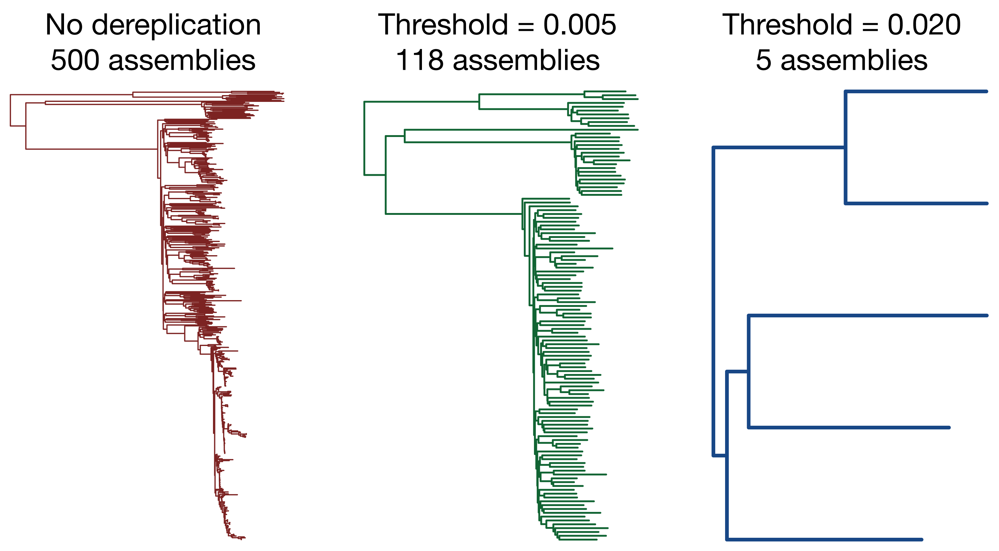

# Assembly Dereplicator

__Ryan R. Wick<sup>1</sup> and Kathryn E. Holt<sup>1,2</sup>__
<br>
<sub>1. Department of Infectious Diseases, Central Clinical School, Monash University, Melbourne, Victoria 3004, Australia<br>2. London School of Hygiene & Tropical Medicine, London WC1E 7HT, UK</sub>

[](https://app.travis-ci.com/rrwick/Assembly-Dereplicator) [](https://www.gnu.org/licenses/gpl-3.0.en.html) [](https://doi.org/10.5281/zenodo.3365572)


## Table of contents

* [Introduction](#introduction)
* [Requirements](#requirements)
* [Installation](#installation)
* [Method](#method)
* [Quick usage](#quick-usage)
* [Full usage](#full-usage)
* [License](#license)


## Introduction

This repo contains a standalone Python script ([`dereplicator.py`](dereplicator.py)) to solve a problem I occasionally run into: dereplicating a group of bacterial genome assemblies. Dereplication means removing assemblies for which there are sufficiently close relatives, resulting in a smaller set where the assemblies are more unique.

As an example, imagine you have 10000 genome assemblies for a particular taxon and want to do some analysis on them, maybe building a pan genome. You know there is redundancy in this set because some of the genomes come from outbreaks and are nearly identical to each other. So instead of doing the analysis on all 10000 assemblies, you can dereplicate them to a smaller set (i.e. remove near-identical redundant genomes) so your analysis will be faster.


## Example

<p align="center"><picture><source srcset="images/trees-dark.png" media="(prefers-color-scheme: dark)"></picture></p>

To give you a visual idea of how this works, here are trees built from 1000 assemblies from the genus _Klebsiella_ dereplicated to various distance levels. You can see that in the no-dereplication and lower-distance trees, one clade dominates (corresponding to _K. pneumoniae_, the most sequenced species in the genus). The higher-distance trees are more balanced, and when dereplicated to a distance of 0.025, there is only one assembly per species/subspecies.


## Requirements

You'll need [Python](https://www.python.org/) 3.8 or later to run `dereplicator.py`. It's a standalone script and has no Python package dependencies (i.e. it only uses the standard library).

There is one external dependency, [Mash](https://github.com/marbl/Mash), which you'll need installed and callable on your command line. If you can run `mash sketch -h` and `mash dist -h` without getting an error, you should be good to go!


## Installation

Since Assembly Dereplicator is a single script, no installation is required. You can simply clone it and run it:
```
git clone https://github.com/rrwick/Assembly-dereplicator
Assembly-dereplicator/dereplicator.py --help
```

If you plan on using it often, you can copy it to someplace in your PATH variable for easier access:
```
git clone https://github.com/rrwick/Assembly-dereplicator
cp Assembly-dereplicator/dereplicator.py ~/.local/bin
dereplicator.py --help
```

If you'd like to double-check that everything works as intended, you can run this repo's [automated tests](test).


## Method

The basic dereplication process is to find the closest pair of assemblies in the set, discard the assembly in that pair with the lower N50 value and repeat until a stop condition is reached. By using N50 as a metric of assembly quality, complete assemblies are preferentially kept over draft assemblies.

There are two possible criteria for defining how much to dereplicate:
* A minimum pairwise distance, e.g. `--distance 0.001`. This will make dereplication continue until no two assemblies in the set have a Mash distance of less than the given value.
* An assembly count, e.g. `--count 100`.  This will make dereplication continue until the target number of assemblies is reached.

If both criteria are used, then dereplication will continue until both are satisfied. E.g. `--distance 0.001 --count 100` will ensure that no two assemblies have a Mash distance of greater than 0.001 and there are no more than 100 assemblies.

The process is deterministic, so running the script multiple times will give the same result. Also, running the script in multiple steps (e.g. first with `--distance 0.01` then again with `--distance 0.02`) will give the same result as running in a single step (e.g. using `--distance 0.02` the first time).


## Quick usage

Assembly Dereplicator is easy to run. Just give it an input directory containing your assemblies in FASTA format, an output directory and a value for either `--distance` or `--count`:
```
dereplicator.py --distance 0.01 assembly_dir output_dir
```


## Full usage

```
usage: dereplicator.py [--distance DISTANCE] [--count COUNT] [--sketch_size SKETCH_SIZE]
                       [--threads THREADS] [--verbose] [-h] [--version]
                       in_dir out_dir

Assembly Dereplicator

Positional arguments:
  in_dir                     Directory containing all assemblies
  out_dir                    Directory where dereplicated assemblies will be copied

Dereplication target:
  --distance DISTANCE        Dereplicate until the closest pair has a Mash distance of this value
                             or greater
  --count COUNT              Dereplicate until there are no more than this many assemblies

Settings:
  --sketch_size SKETCH_SIZE  Mash assembly sketch size (default: 10000)
  --threads THREADS          Number of CPU threads for Mash (default: 10)
  --verbose                  Display more output information (default: False)

Other:
  -h, --help                 Show this help message and exit
  --version                  Show program's version number and exit
```

Positional arguments:
* `in_dir`: directory containing input assemblies, will be searched recursively. The input assemblies must be in FASTA format and the script will find them in the input directory based on extension. Any of the following are acceptable: `.fasta`, `.fasta.gz`, `.fna`, `.fna.gz`, `.fa` and `.fa.gz`.
* `out_dir`: directory where dereplicated assemblies (i.e. the representative assembly for each cluster) will be copied. If this directory doesn't exist, it will be created. Copied assemblies will have the same filename they had in the input directory.

Dereplication target:
* `--distance`: the target minimum pairwise Mash distance between assemblies. Mash distance roughly corresponds to one minus average nucleotide identity. Setting it to a small value (e.g. 0.001) will result in more dereplicated assemblies, i.e. only very close relatives will be excluded. Setting it to a large value (e.g. 0.02) will result in fewer dereplicated assemblies, perhaps just one per species.
* `--count`: the target number of output assemblies. If this value is equal to or greater than the number of input assemblies, no dereplication will take place.
* Either `--distance` or `--count` (or both) must be used.

Settings:
* `--sketch_size`: controls the [Mash sketch size](https://mash.readthedocs.io/en/latest/sketches.html#sketch-size). A smaller value (e.g. 1000) will make the process faster but slightly less accurate.
* `--threads`: controls how many threads Mash uses for its sketching and distances. Mash scales well in parallel, so use lots of threads if you have them!
* `--verbose`: using this flag results in more information being printed to stdout.


## Performance

Since `dereplicator.py` uses pairwise distances, it scales with the square of the number of input assemblies, i.e. _O_(_n_<sup>2</sup>). This means that small numbers of input assemblies (e.g. <100) will be very fast, and large numbers (e.g. >10000) will take much longer. Mash parallelises well, so use as many threads as you can for large datasets.

As a test, I ran `dereplicator.py` on all [_Klebsiella_ genomes in GTDB](https://gtdb.ecogenomic.org/tree?r=g__Klebsiella). At the time of writing, this was about 13700 assemblies, so about 188 million pairwise comparisons. Using 48 CPU threads, the process took about 40 minutes to complete and used about 35 GB of RAM.


## License

[GNU General Public License, version 3](https://www.gnu.org/licenses/gpl-3.0.html)
